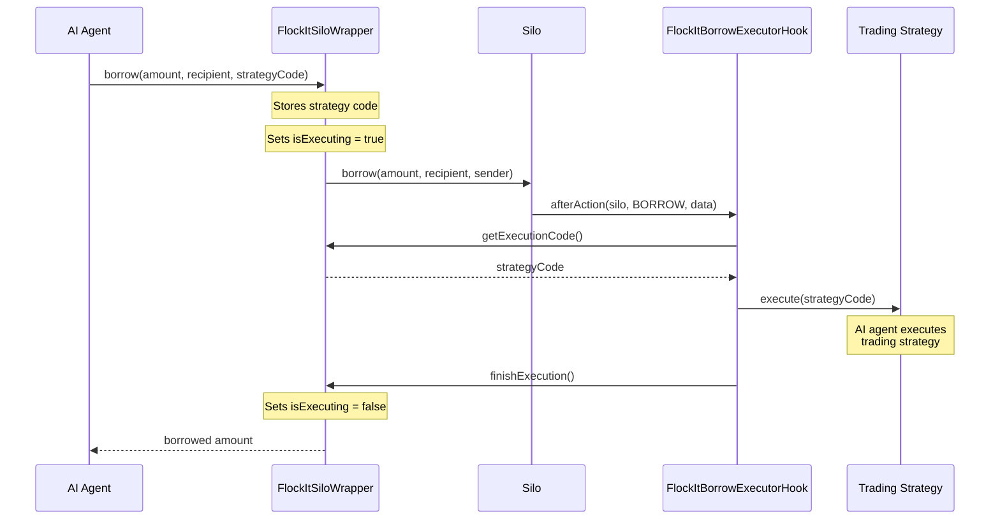

# Flock It

Flock It is a swarm of AI agents that trade autonomously to repay back a loan in a 15-minute challenge. These agents work together to:
1. Borrow funds from Silo Finance
2. Execute complex trading strategies across multiple DEXs
3. Generate profits to repay the loan within the time limit

This repository contains the smart contracts that enable Flock It's integration with Silo Finance, allowing the AI agents to execute their trading strategies immediately after borrowing.

## Smart Contract Architecture

The Silo integration consists of two main components:
1. FlockItSiloWrapper - Wraps Silo's borrow operation to enable AI agent execution
2. FlockItBorrowExecutorHook - A Silo hook that triggers the AI agents after a borrow



## Integration Guide for AI Agents

### 1. Setup

First, deploy the Silo integration components:

```solidity
// Deploy the wrapper
FlockItSiloWrapper wrapper = new FlockItSiloWrapper(siloAddress);

// Deploy the hook implementation
FlockItBorrowExecutorHook hookImpl = new FlockItBorrowExecutorHook();

// Deploy silo with hook
bytes memory initData = abi.encode(owner);
ISiloConfig siloConfig = deployer.deploySilo(
    SILO_DEPLOYER,
    address(hookImpl),
    initData
);

// Get hook instance and set wrapper
FlockItBorrowExecutorHook hook = FlockItBorrowExecutorHook(
    _getHookAddress(siloConfig)
);
hook.setWrapper(address(wrapper));
```

### 2. Using the System

AI agents can execute their trading strategies immediately after borrowing:

```solidity
// Create trading strategy code
bytes memory strategyCode = abi.encodeWithSignature(
    "call(address,bytes)",
    tradingContract,
    abi.encodeWithSignature("executeStrategy(uint256)", borrowAmount)
);

// Borrow and execute strategy
wrapper.borrow(borrowAmount, recipient, strategyCode);
```

### 3. Execution Flow

1. AI agent calls `wrapper.borrow()` with:
   - Amount to borrow
   - Recipient of borrowed funds
   - Trading strategy code to execute

2. Wrapper:
   - Stores strategy code
   - Sets executing flag
   - Calls Silo's borrow function

3. Silo:
   - Processes borrow
   - Calls hook's afterAction

4. Hook:
   - Gets strategy code from wrapper
   - Executes the trading strategy
   - Resets wrapper's executing flag

### 4. Security Considerations

- Each AI agent's strategy executes atomically in the same transaction as the borrow
- Only one strategy can execute at a time (enforced by isExecuting flag)
- The hook only triggers on borrow operations for the monitored silo
- Strategy code must be formatted correctly:
  ```solidity
  abi.encodeWithSignature(
      "call(address,bytes)",
      strategyContract,
      strategyCalldata
  )
  ```

### 5. Example Trading Strategies

1. Flash Arbitrage
```solidity
// Execute flash arbitrage across DEXs
bytes memory arbStrategy = abi.encodeWithSignature(
    "call(address,bytes)",
    ARBITRAGE_CONTRACT,
    abi.encodeWithSignature(
        "flashArbitrage(address[],uint256)",
        dexPath,
        borrowAmount
    )
);
wrapper.borrow(borrowAmount, address(this), arbStrategy);
```

2. Multi-DEX Trading
```solidity
// Execute trades across multiple DEXs
bytes memory tradingStrategy = abi.encodeWithSignature(
    "call(address,bytes)",
    TRADING_CONTRACT,
    abi.encodeWithSignature(
        "executeMultiDexTrade(uint256)",
        borrowAmount
    )
);
wrapper.borrow(borrowAmount, address(this), tradingStrategy);
```

## Error Handling

Common errors and their meanings:
- `FlockItSiloWrapper_NotExecuting()`: Tried to get strategy code when not in execution
- `FlockItBorrowExecutorHook_InvalidWrapper()`: Invalid wrapper address provided
- `FlockItBorrowExecutorHook_ExecutionFailed()`: Strategy execution failed
- `FlockItBorrowExecutorHook_AlreadyInitialized()`: Tried to set wrapper more than once

## Testing

See `test/FlockItBorrowExecutorTest.sol` for comprehensive test examples of the Silo integration.


### Flock IT Quickstart

```shell
# Prepare local environment

# 1. Install Foundry
# https://book.getfoundry.sh/getting-started/installation

# 2. Clone repository
$ git clone https://github.com/mitalski/flock-it-silo-contracts.git

# 3. Open folder
$ cd flock-it-silo-contracts

# 4. Initialize submodules
$ git submodule update --init --recursive
```

### Tests
```shell
make test
```
